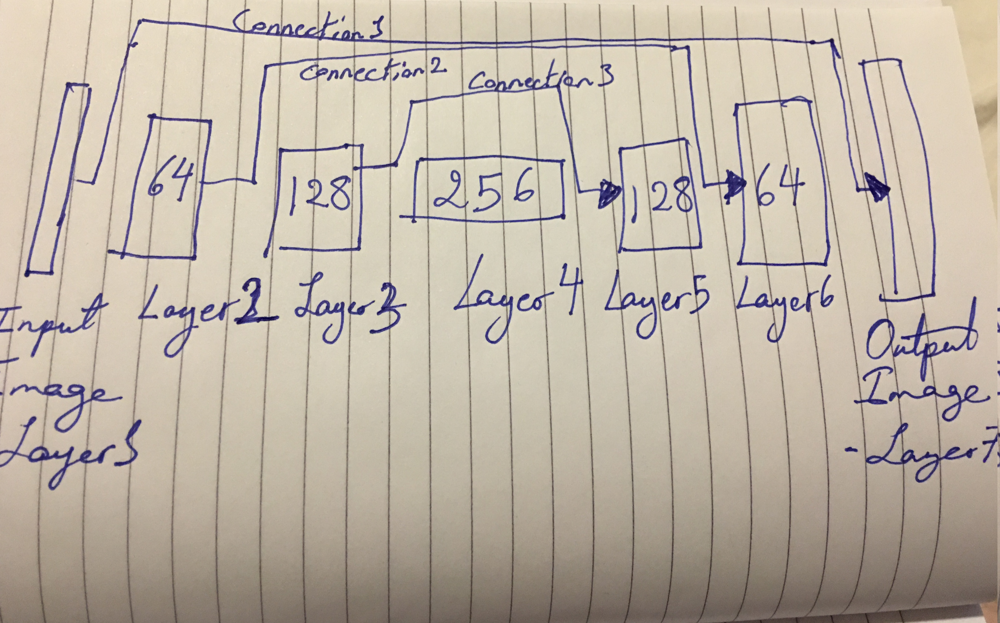
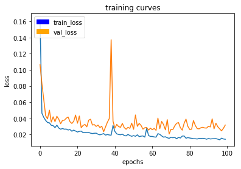

## Project Details

## Objective & Goal :

The purpose of this excercise is to preform  semantic segmentation by developing a deep learning network that locates a particular human target within an image.This deep learning model that will allow a simulated quadcopter to follow around the person that it detects!

## Additional Submissions :
In addition to this report note that the html version of the notebook  and .h5 files of the weights (in weights forlder) are submitted as part of this repository.

## 1- Network Architecture : 

__Nueral Network  Architecture & Philosophy :__

The network architecture used is that of a fully convlutional network.Such networks are widely used for object tracking in computer vision application and robotics. The reason an architecture of fully convultional network is chosen over previously used fully connected layer is because spatial information of where the object recognized in the image is preserved which is needed when tracking objects.

The fully convultional nueral network is composed of 3 main stages, the encoding stage, the implementation of 1x1 convultional layer, and the decoding stage. In the below table is a summary of each 

| Layer Number       | Purpose       | Layer Size and Dimension          | Layer Depth  |
| ------------- | ------------- |:-------------:| -----:|
| Layer 1        | Input Layer-Image | 160 x 160 | 3 |
| Layer 2       | Encoder 1 | 80 x 80 | 64 |
| Layer 3       | Encoder 2 | 40 x 40 | 128|
| Layer 4       | 1 x 1 layer | 20 x 20 | 256 |
| Layer 5       | Decoder 1 | 40 x 40 | 128|
| Layer 6       | Decoder 2 | 80 x 80 | 64 |
| Layer 7       |Output Layer | 160 x 160 | 3 |

__Encoding Layers :__

An encoding layer is implemented to extract the features and distictinve features in the image. In principal encoding layers can be used mainly for object recognition in an image. In our implementation 2 encoding layer have been used. The first layer takes an image of 3 layers (R-G-B) and ouputs a layer of depth 64. The second layer we implement a kernel size of 128 and decreasing its size by half as well.

__1x1 Convultions :__

__Decoding Layers :__

Decoding layers are implemented at the end of the neural network model to retreive spatial infromation, to locate the recognized object in the image, such necessary infromation may have been lost due to the encoding and downsizing of the image. During decoding stage bileniar upsampling by 2 is preformed through 2 different decoding layers.
The first decoding layer is then convluted with a filter of depth 128 while the second decoding layer is then convoluted again with a filter of depth 64. In such method the layer depeth decreasaes from one layer to another. Also in each decoding the image is upsampled by a factor of 2 to retreive the spatial information.

__Fully Connected Layers :__
 

__Hyper Parameters :__

No of Parameters | Learning Rate | Batch Size | Number of Epochs | Steps Per Epoch  | Validation Steps | Workers
--- | --- | --- | --- | ---| --- | ---
6 | 0.005 | 32 | 100 | 200| 50| 4

## 2- Training and Results : 

__Setup :__
The nueral network was initailly trained for 5 epochs on the local computer (Training time took 3 hours) and initially acheived a result of 36% accuracy. However it was evident that the number of epochs had to increase to improve the accuracy of the model. In order to speed up the training process AWS instances (p2.xlarge instance) were used and for 100 epochs. Training with AWS for 100 epochs took around 4 hours to complete.  

__Results :__

The final accuracy result received based on the above mentioned hyperparameters was __41.8%__ which is above the required passing score of 40%. However this result can be further improved. 

The below image shows the output of the training process. The model was trained for 100 epochs using AWS instances. T

## 3- Conclusions & Future Work : 

While the result obtained is above what is required it can still be enhanced. More data can be collected to improve the accuracy of the nueral network. In addition more experimintation can be done on the hyper paremeters to obtain better results.

